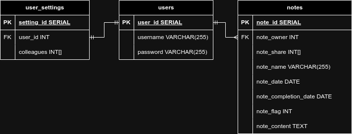
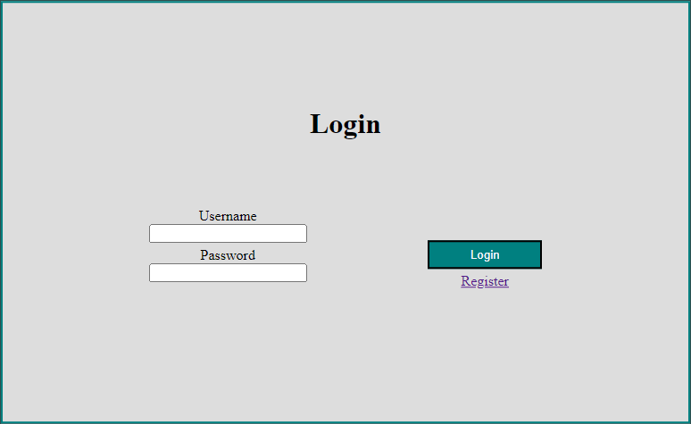
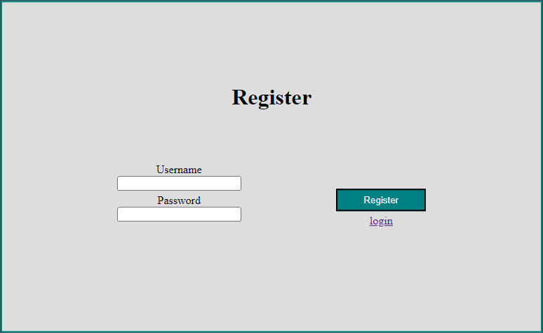
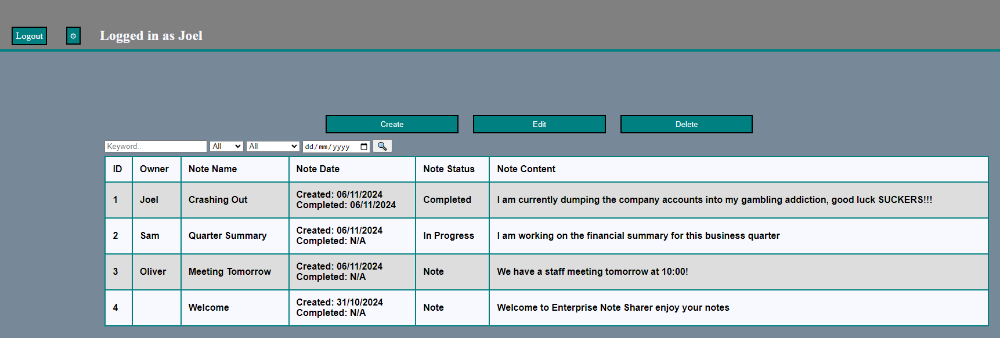
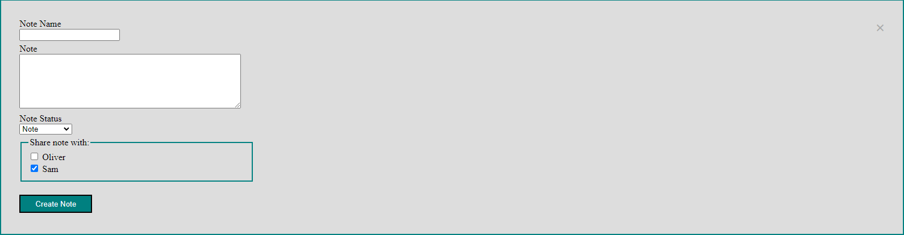
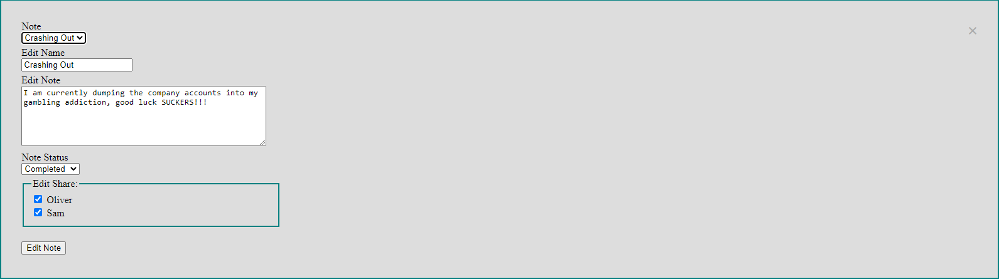
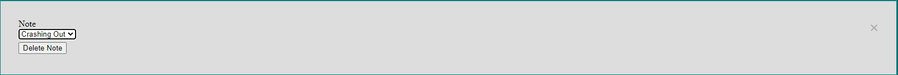
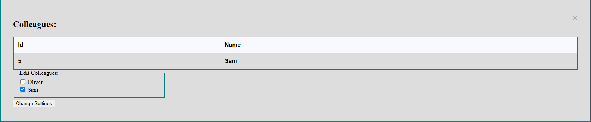

# Documentation

This file documents the use and design decisions of this project.

## Dependencies

- [Gorilla - mux](https://github.com/gorilla/mux)
  - HTTP router.
- [icza - session](https://github.com/icza/session)
  - Creating user sessions
- [Jackc - pgx](https://github.com/jackc/pgx)
  - PostgreSQL Driver
- [lib - pq](https://github.com/lib/pq)
  - Used for the Array types that can be scanned from the db
- [x - crypto](https://golang.org/x/crypto)
  - Used to encrypt user passwords

## File structure

### Directories

- `./docs`: contains files relevant to documentation
- `./sqlScripts`: contains scripts for setting up the database
- `./statics`: contains static files to be server to the client (css)
- `./web`: contains html for templates

### Source Files

- `main.go`: entry point for the application
- `app.go`: Initialises the vital components of the app and contains main loop
- `auth.go`: Responsible for login and register functionality
- `constants.go`: Contains global constants
- `handler-helper.go`: Contains non handler functions used in `handlers.go`
- `handlers.go` Contains handlers for the router
- `util.go` Contains utility function used across multiple files

### Special Files

- `dbImported`: This file tells the server that the database has already been created, so it doesn't rebuild the db every time it starts. This file is automatically created after `App::importData()` is run.

## Running the server

Make sure that PostgreSQL is running and is configured as follows:

- host     = localhost (127.0.0.1)
- hort     = 5432
- user     = postgres
- password = pp
- name     = postgres

Alternatively see the constants in `constants.go` and configure them to your SQL server\
\
Then simply run `go run .`

## Design Philosophy

When building this application I approached it with a develop quickly,
fail quicker approach. In practice this meant writing required
functionality as simply as possible working out any bugs or issues with it
and then reiterating upon it until I was satisfied with its functionality and robustness.

## Naming Convention

When naming I used camel case as it is the official naming convention for go.

## Database Design

### ERD

### Placeholders

I encountered a problem when checking if a table already had an entry I wanted to insert. If the table contained zero entries a different error
would be returned instead of `sql.ErrNoRows`, stopping data from being inserted because I was looking for this error to insert that entry.
\
I solved this issue by inserting a placeholder entry when creating the
tables. For users I added an empty user by the name `__placeholder__user__`
and I added a welcome note shared globally for the notes table.
I did not have to worry about the user_settings table as I just inserted a entry when a user was added.\
While this approach works it is probably quite naive and a better solution
most certainly exists.

### Avoiding SQL Injection

I have minimized SQL injection risks by taking the following precautionary steps:

- When a user creates an account spaces are not allowed in the username or password
- SQL statements are prepared and parameterized, apposed to concatenation or using fmt

## UX/UI

The UI I have developed for the website is purposely bare bones and simple. This allowed me to
focus on the backend implementation and rapidly develop a UI around it. In the first stages
of development it was purely HTML with no CSS, and the CSS that is in the final version is
nothing fancy (gets the job done).

### Login / Register

Any errors with input data will appear below the login button.

Once registered the user will be taken back to the login page. Error messages will appear in the same
place as the login page.

### Dashboard

Contains your notes and those shared with you.

### Create a Note

### Edit a Note

Fields update to the notes content and options when you change the note.

### Delete a Note

### User Settings

## Testing

While I haven't setup unit testing I have manually tested the functionality
of the app, the results are in the following tables.

### Backend Tasks

| Action | Expected | Result |
| ------ | -------- | ------ |
| Attempt connection to database when PGSQL server is running | Backend successfully establishes a connection to the database | Passed &#9989; |
| Attempt connection to database when PGSQL server is not running | Backend logs an error and safely exits | Passed &#9989; |
| Error logging | When an error is thrown it is caught and displayed clearly to the end-user and developer without crashing the server if it isn't severe | Passed &#9989; |
| Server initialisation | Application successfully initialises logging relevant information | Passed &#9989; |
| Serving a template with `executeTemplate` | Template will be served to client with correct information present | passed &#9989; |

### Authorization Tasks

| Action | Expected | Result |
| ------ | -------- | ------ |
| Register a new account | A new entry added to users of same name and password | Passed &#9989; |
| Register an existing account | Data is rejected and user prompted with warning | Passed &#9989; |
| Register a new account with an invalid name/password | Data is rejected and user prompted with warning | Passed &#9989; |
| Login with an existing account and correct password | Taken to dashboard logged in as that user | Passed &#9989; |
| Login with an existing account and wrong password | Rejected and user prompted with warning | Passed &#9989; |
| Login with an account that doesn't exist | Rejected and user prompted with warning | Passed &#9989; |

### Dashboard Tasks

| Action | Expected | Result |
| ------ | -------- | ------ |
| Create a note | A new note will be created in the database and displayed with the correct user data | Passed &#9989; |
| Viewing a shared note | The dashboard displays the notes shared with the logged in user | Passed &#9989; |
| Edit a note | The chosen note will be updated in the database and changes will be displayed | Passed &#9989; |
| Selecting a note to edit | The input fields in the edit modal content will be set to the correct content | Passed &#9989; |
| Delete a note | The chosen note will be removed from the database and dashboard | Passed &#9989; |
| Set colleagues in settings | User settings will be updated to include the chosen colleagues | Passed &#9989; |
| Search for note by name | The list of accessible notes in the dashboard will be filtered to only the ones with that name or notes that contain its name | Passed &#9989; |
| Search for note by owner | The list of accessible notes in the dashboard will be filtered to only the ones owned by that user | Passed &#9989; |
| Search for note by flag | The list of accessible notes in the dashboard will be filtered to only the ones with that flag | Passed &#9989; |
| Search for note by date | The list of accessible notes in the dashboard will be filtered to only the ones created or completed on that date | Passed &#9989; |
